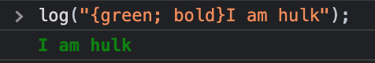
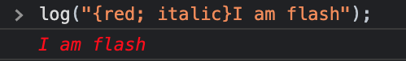
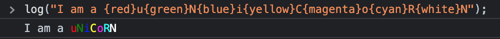

# `console.unicorn`

## I am Hulk

```js
log("{green; bold}I am hulk");
```



## I am Flash

```js
log("{red; italic}I am flash");
```



## I AM A UNICORN

```js
log("I am a {red}u{green}N{blue}i{yellow}C{magenta}o{cyan}R{white}N");
```



## Usage

```js
const parse = require("console.unicorn");

const [placeholder, ...styles] = parse("{red; italic}I am flash");

console.log.apply(console, [placeholder, ...styles, ...args]);
```
